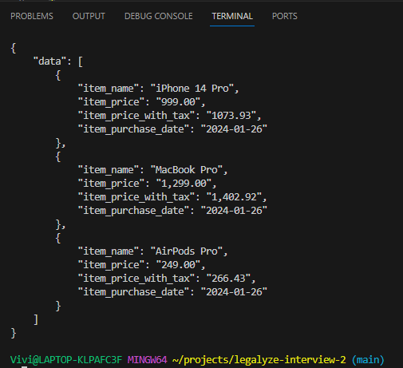

# Receipt Parser

## Introduction
Receipt Parser is a project designed to transform unstructured receipt data into structured, easily manageable information. By leveraging delimiters to break up data, utilizing language models for item recognition, and parallelizing tasks for efficiency, this tool aims to output structured JSON for each item on a receipt.

## Thought Process

### 1. Data Segmentation
First, we separate the unstructured data using delimiters. The goal is to avoid treating structured data as a monolithic block, opting instead to organize it into a database or a memory store for easier access and manipulation.

### 2. Data Retrieval Strategy
The objective is to generate a structured JSON representation for each item. This involves sending item data to a Language Learning Model (LLM), either in a single context or across multiple contexts, to accurately identify and structure each item.

### 3. Parallel Processing
Given that each item's processing is independent, we parallelize these tasks. This approach significantly enhances both the speed and accuracy of data processing.

### 4. Data Consolidation
After all tasks have completed, we consolidate the data, ensuring it is correctly formatted before printing or writing it to a file.

## Installation

To set up the Receipt Parser project, you'll need to install the required dependencies. Open your terminal and run the following command:

```bash
pip install -r requirements.txt
```

## Output Example

The following image illustrates an example of the output generated by the Receipt Parser. It shows how the unstructured data from a receipt is transformed into a structured JSON format.


